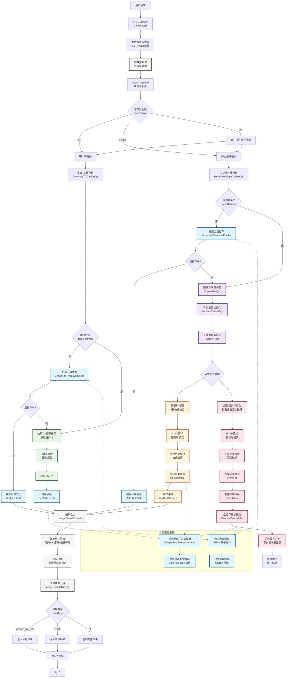
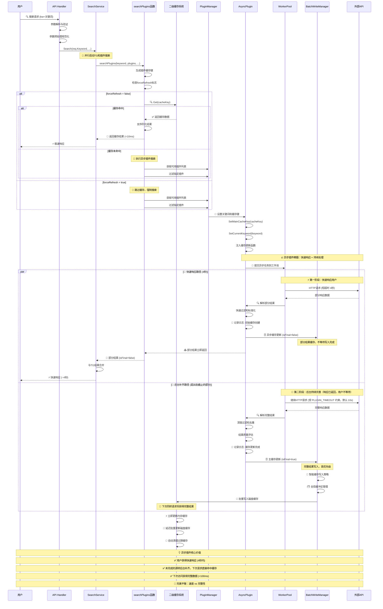
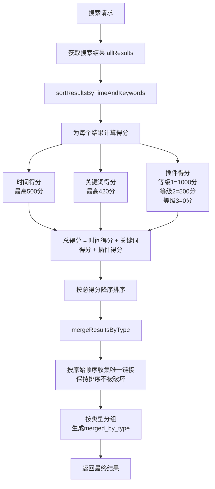
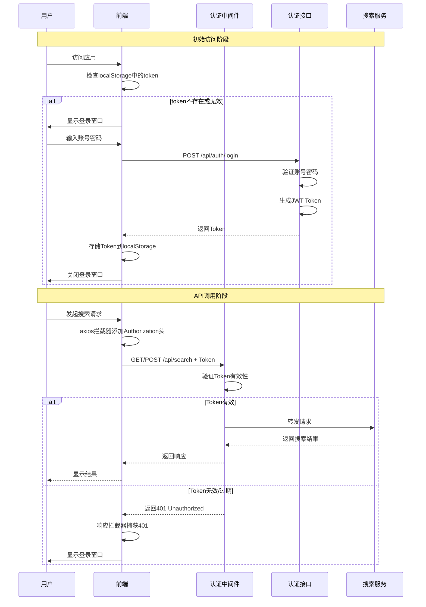

# PanSou 网盘搜索系统开发设计文档

## 📋 文档目录

- [1. 项目概述](#1-项目概述)
- [2. 系统架构设计](#2-系统架构设计)
- [3. 异步插件系统](#3-异步插件系统)
- [4. 二级缓存系统](#4-二级缓存系统)  
- [5. 核心组件实现](#5-核心组件实现)
- [6. 智能排序算法详解](#6-智能排序算法详解)
- [7. API接口设计](#7-api接口设计)
- [8. 认证系统设计](#8-认证系统设计)
- [9. 插件开发框架](#9-插件开发框架)
- [10. 性能优化实现](#10-性能优化实现)
- [11. 技术选型说明](#11-技术选型说明)
- [12. 并发与超时调度](#12-并发与超时调度)
- [13. 存活观测](#13-存活观测)
- [14. 源码守卫测试](#14-源码守卫测试)

---

> **本次迭代说明（2026-09-26）**
>
> 对照当前代码逐条复核并修正了过期断言，主要变更：
> 1. 超时模型由"双级超时 4 秒 / 30 秒"改为**4 秒同步窗口 + 波次推导的批截止**（夹在 `[4s, PLUGIN_TIMEOUT=10s]`），
>    超窗部分转后台补齐。原文的"30 秒"在代码里已无对应开关。
> 2. 插件并发不再由请求参数 `conc` 决定，改为 `effectiveFanoutConcurrency` 取"请求并发与任务数的较大者"，
>    再受出口上限收口；新增第 12 章说明这四层调度。
> 3. 新增第 13 章（存活观测）、第 14 章（源码守卫测试），这两块原文完全没有。
> 4. 网盘类型由 12 种更正为 **13 种**（`util/regex_util.go:GetLinkType`，另有 `others` 兜底）。
> 5. 插件规模更正：仓库 **111 个插件包**，`main.go` 注册 **76 个**，Docker 部署启用 **69 个**；
>    原文 §3.4 列出的 10 个插件里有 8 个早已不在注册列表内。
> 6. 修正 9 处章节编号错位（如 `## 7` 下写着 `### 6.2`）。
> 7. 默认 TG 频道更正为 `tgsearchers7`（`config/config.go:163`）。

## 1. 项目概述

### 1.1 项目定位

PanSou是一个高性能的网盘资源搜索API服务，支持TG搜索和自定义插件搜索。系统采用异步插件架构，具备二级缓存机制和并发控制能力，在MacBook Pro 8GB上能够支持500用户并发访问。

### 1.2 核心特性

- **异步插件系统**: 两级时间预算——4 秒同步响应窗口 + 由波次推导的批截止（夹在 `[4s, PLUGIN_TIMEOUT=10s]`），超出窗口的部分转后台补齐（见 §12）
- **二级缓存系统**: 分片内存缓存+分片磁盘缓存，GOB序列化
- **工作池管理**: 基于`util/pool`的并发控制
- **四层并发调度**: 出口并发门（默认 128）+ 请求参数只作下界 + 波次推导批截止 + 自适应并发（见 §12）
- **存活观测**: 按 20 轮滑动窗口累积每个插件/频道的产出与失败，暴露在 `/api/health`（见 §13）
- **智能结果合并**: `mergeSearchResults`函数实现去重合并
- **多维度排序**: 插件等级+时间新鲜度+优先关键词综合评分
- **多网盘类型支持**: 自动识别 13 种网盘类型，另有 `others` 兜底（`util/regex_util.go:GetLinkType`）

---

## 2. 系统架构设计

### 2.1 整体架构流程



### 2.2 异步插件工作流程



### 2.3 核心组件

#### 2.3.1 HTTP服务层 (`api/`)
- **router.go**: 路由配置
- **handler.go**: 请求处理逻辑
- **middleware.go**: 中间件（日志、CORS等）

#### 2.3.2 搜索服务层 (`service/`)
- **search_service.go**: 核心搜索逻辑，结果合并

#### 2.3.3 插件系统层 (`plugin/`)
- **plugin.go**: 插件接口定义
- **baseasyncplugin.go**: 异步插件基类
- **各插件目录**: jikepan、pan666、hunhepan等

#### 2.3.4 工具层 (`util/`)
- **cache/**: 二级缓存系统实现
- **pool/**: 工作池实现
- **其他工具**: HTTP客户端、解析工具等

---

## 3. 异步插件系统

### 3.1 设计理念

异步插件系统解决传统同步搜索响应慢的问题，采用"尽快响应，持续处理"策略：
- **4秒短超时**: 快速返回部分结果（`isFinal=false`）
- **30秒长超时**: 后台继续处理，获得完整结果（`isFinal=true`）
- **主动缓存更新**: 完整结果自动更新主缓存，下次访问更快

### 3.2 插件接口实现

基于`plugin/plugin.go`的实际接口：

```go
type AsyncSearchPlugin interface {
    Name() string
    Priority() int
    
    AsyncSearch(keyword string, searchFunc func(*http.Client, string, map[string]interface{}) ([]model.SearchResult, error), 
               mainCacheKey string, ext map[string]interface{}) ([]model.SearchResult, error)
    
    SetMainCacheKey(key string)
    SetCurrentKeyword(keyword string)
    Search(keyword string, ext map[string]interface{}) ([]model.SearchResult, error)
}
```

### 3.3 基础插件类

`plugin/baseasyncplugin.go`提供通用功能：

```go
type BaseAsyncPlugin struct {
    name              string
    priority          int
    cacheTTL          time.Duration
    mainCacheKey      string
    currentKeyword    string        // 用于日志显示
    httpClient        *http.Client
    mainCacheUpdater  func(string, []model.SearchResult, time.Duration, bool, string) error
}
```

### 3.4 已实现插件列表

规模事实（可用命令复核）：

| 项 | 数量 | 复核方式 |
| --- | --- | --- |
| `plugin/` 下的插件包 | 111 | `ls -d plugin/*/ \| wc -l` |
| `main.go` 中 blank import 注册 | 76 | `grep -c "pansou/plugin/" main.go` |
| Docker 部署启用（`ENABLED_PLUGINS`） | 69 | `docker-compose.yml` 的 `ENABLED_PLUGINS` 行 |

- 插件通过 `import _ "pansou/plugin/xxx"` 触发各自的 `init()` 完成注册；未被 import 的插件包
  即使存在目录也不会编译进二进制（现有 35 个属于此类，含 `hdr4k`、`jikepan`、`panyq`、`xuexizhinan` 等）。
- 已核验：`ENABLED_PLUGINS` 里启用的 69 个**全部**在注册列表内，不存在"启用了但没注册"的静默失效。
- 另有 7 个已注册但未启用的插件，属于可选项。

### 3.5 插件注册机制

```go
// 全局插件注册表（plugin/plugin.go）
var globalRegistry = make(map[string]AsyncSearchPlugin)

// 插件通过init()函数自动注册
func init() {
    p := &MyPlugin{
        BaseAsyncPlugin: plugin.NewBaseAsyncPlugin("myplugin", 3),
    }
    plugin.RegisterGlobalPlugin(p)
}
```

---

## 4. 二级缓存系统

### 4.1 实现架构

基于`util/cache/`目录的实际实现：

- **enhanced_two_level_cache.go**: 二级缓存主入口
- **sharded_memory_cache.go**: 分片内存缓存（LRU+原子操作）
- **sharded_disk_cache.go**: 分片磁盘缓存
- **serializer.go**: GOB序列化器
- **cache_key.go**: 缓存键生成和管理

### 4.2 分片缓存设计

#### 4.2.1 内存缓存分片
```go
// 基于CPU核心数的动态分片
type ShardedMemoryCache struct {
    shards    []*MemoryCacheShard
    shardMask uint32
}

// 每个分片独立锁，减少竞争
type MemoryCacheShard struct {
    data map[string]*CacheItem
    lock sync.RWMutex
}
```

#### 4.2.2 磁盘缓存分片
```go
// 磁盘缓存同样采用分片设计
type ShardedDiskCache struct {
    shards    []*DiskCacheShard  
    shardMask uint32
    basePath  string
}
```

### 4.3 缓存读写策略

#### 4.3.1 读取流程
1. **内存优先**: 先检查分片内存缓存
2. **磁盘回源**: 内存未命中时读取磁盘缓存
3. **异步加载**: 磁盘命中后异步加载到内存

#### 4.3.2 写入流程  
1. **智能写入策略**: 立即更新内存缓存，延迟批量写入磁盘
2. **DelayedBatchWriteManager**: 智能缓存写入管理器，支持immediate和hybrid两种策略
3. **原子操作**: 内存缓存使用原子操作
4. **GOB序列化**: 磁盘存储使用GOB格式
5. **数据安全保障**: 程序终止时自动保存所有待写入数据，防止数据丢失

### 4.4 缓存键策略

`cache_key.go`实现了智能缓存键生成：

```go
// TG搜索和插件搜索使用不同的缓存键前缀
func GenerateTGCacheKey(keyword string, channels []string) string
func GeneratePluginCacheKey(keyword string, plugins []string) string
```

**优势**:
- 独立更新：TG和插件缓存互不影响
- 提高命中率：精确的键匹配
- 并发安全：分片设计减少锁竞争

### 4.5 序列化性能

使用GOB序列化（`serializer.go`）的实际优势：
- **性能**: 比JSON序列化快约30%
- **体积**: 比JSON小约20%
- **兼容**: Go原生支持，无外部依赖

---

## 5. 核心组件实现

### 5.1 工作池系统 (`util/pool/`)

#### 5.1.1 worker_pool.go 实现
- **批量任务处理**: `ExecuteBatchWithTimeout`方法
- **超时控制**: 支持任务级别的超时设置
- **并发限制**: 控制最大工作者数量

#### 5.1.2 object_pool.go 实现  
- **对象复用**: 减少内存分配和GC压力
- **线程安全**: 支持并发访问

### 5.2 HTTP服务配置

#### 5.2.1 服务器优化（基于config/config.go）
```go
// 自动计算HTTP连接数，防止资源耗尽
func getHTTPMaxConns() int {
    cpuCount := runtime.NumCPU()
    maxConns := cpuCount * 25  // 保守配置
    
    if maxConns < 100 {
        maxConns = 100
    }
    if maxConns > 500 {
        maxConns = 500  // 限制最大值
    }
    
    return maxConns
}
```

#### 5.2.2 连接池配置（基于util/http_util.go）
```go
// HTTP客户端优化配置
transport := &http.Transport{
    MaxIdleConns:        100,
    MaxIdleConnsPerHost: 10,
    IdleConnTimeout:     90 * time.Second,
}
```

### 5.3 结果处理系统

#### 5.3.1 智能排序算法（service/search_service.go）

PanSou 采用多维度综合评分排序算法，确保高质量结果优先展示：

**评分公式**:
```
总得分 = 插件得分(1000/500/0/-200) + 时间得分(最高500) + 关键词得分(最高420)
```

**权重分配**:
- 🥇 **插件等级**: ~52% (主导因素) - 等级1(1000分) > 等级2(500分) > 等级3(0分)
- 🥈 **关键词匹配**: ~22% (重要因素) - "合集"(420分) > "系列"(350分) > "全"(280分)
- 🥉 **时间新鲜度**: ~26% (重要因素) - 1天内(500分) > 3天内(400分) > 1周内(300分)

**关键优化**:
- **缓存性能**: 跳过空结果和重复数据的缓存更新，减少70%无效操作
- **排序稳定性**: 修复map遍历随机性问题，确保merged_by_type保持排序
- **插件管理**: 启动时按优先级排序显示已加载插件，便于监控

#### 5.3.2 结果合并（mergeSearchResults函数）
- **去重合并**: 基于UniqueID去重
- **完整性选择**: 选择更完整的结果保留
- **增量更新**: 新结果与缓存结果智能合并

### 5.4 网盘类型识别

支持自动识别的网盘类型（共12种）：
- 百度网盘、阿里云盘、夸克网盘、天翼云盘
- UC网盘、移动云盘、115网盘、PikPak
- 迅雷网盘、123网盘、磁力链接、电驴链接

---

## 6. 智能排序算法详解

### 6.1 算法概述

PanSou 搜索引擎采用多维度综合评分排序算法，确保用户能够优先看到最相关、最新、最高质量的搜索结果。

#### 6.1.1 核心设计理念

1. **质量优先**：高等级插件的结果优先展示
2. **时效性重要**：新发布的资源获得更高权重
3. **相关性保证**：关键词匹配度影响排序
4. **用户体验**：最终排序结果保持稳定性

#### 6.1.2 排序流程



### 6.2 评分算法详解

#### 6.2.1 核心公式
```
总得分 = 时间得分 + 关键词得分 + 插件得分
```

#### 6.2.2 时间得分 (Time Score)

时间得分反映资源的新鲜度，**最高 500 分**：

| 时间范围 | 得分 | 说明 |
|---------|------|------|
| ≤ 1天   | 500  | 最新资源，最高优先级 |
| ≤ 3天   | 400  | 非常新的资源 |
| ≤ 1周   | 300  | 较新资源 |
| ≤ 1月   | 200  | 相对较新 |
| ≤ 3月   | 100  | 中等新鲜度 |
| ≤ 1年   | 50   | 较旧资源 |
| > 1年   | 20   | 旧资源 |
| 无日期   | 0    | 未知时间 |

#### 6.2.3 关键词得分 (Keyword Score)

关键词得分基于搜索词在标题中的匹配情况，**最高 420 分**：

| 优先关键词 | 得分 | 说明 |
|-----------|------|------|
| "合集" | 420 | 最高优先级 |
| "系列" | 350 | 高优先级 |
| "全" | 280 | 中高优先级 |
| "完" | 210 | 中等优先级 |
| "最新" | 140 | 较低优先级 |
| "附" | 70 | 低优先级 |
| 无匹配 | 0 | 无加分 |

#### 6.2.4 插件得分 (Plugin Score)

插件得分基于数据源的质量等级，体现资源可靠性：

| 插件等级 | 得分 | 说明 |
|---------|------|------|
| 等级1   | 1000 | 顶级数据源 |
| 等级2   | 500  | 优质数据源 |
| 等级3   | 0    | 普通数据源 |
| 等级4   | -200 | 低质量数据源 |

### 6.3 权重分析与实际效果

#### 6.3.1 权重分配

| 维度 | 最高分值 | 权重占比 | 影响说明 |
|------|---------|---------|----------|
| 插件等级 | 1000 | ~52% | **主导因素**，决定基础排序 |
| 关键词匹配 | 420 | ~22% | **重要因素**，优先关键词显著加分 |
| 时间新鲜度 | 500 | ~26% | **重要因素**，同等级内排序关键 |

#### 6.3.2 实际排序示例

| 场景 | 插件等级 | 时间 | 关键词 | 总分 | 排序 |
|------|---------|------|--------|------|------|
| 等级1 + 1天内 + "合集" | 1000 | 500 | 420 | **1920** | 🥇 第1 |
| 等级1 + 1天内 + "系列" | 1000 | 500 | 350 | **1850** | 🥈 第2 |
| 等级1 + 1月内 + "合集" | 1000 | 200 | 420 | **1620** | 🥉 第3 |
| 等级2 + 1天内 + "合集" | 500 | 500 | 420 | **1420** | 第4 |
| 等级1 + 1天内 + 无关键词 | 1000 | 500 | 0 | **1500** | 第5 |

---

## 7. API接口设计

### 7.1 核心接口实现（基于api/handler.go）

#### 7.1.1 搜索接口
```
POST /api/search
GET  /api/search
```

**核心参数**:
- `kw`: 搜索关键词（必填）
- `channels`: TG频道列表
- `plugins`: 插件列表  
- `cloud_types`: 网盘类型过滤
- `ext`: 扩展参数（JSON格式）
- `refresh`: 强制刷新缓存
- `res`: 返回格式（merge/all/results）
- `src`: 数据源（all/tg/plugin）

#### 7.1.2 健康检查接口
```
GET /api/health
```

返回系统状态和已注册插件信息。

#### 7.1.3 链接检测接口
```
POST /api/check/links
```

检测指定网盘分享链接当前是否有效，支持批量检测和服务端缓存复用。

**核心参数**:
- `items`: 待检测链接数组，至少提供一项
- `items[].disk_type`: 网盘类型，支持 `baidu`、`aliyun`、`quark`、`tianyi`、`uc`、`mobile`、`115`、`xunlei`、`123`
- `items[].url`: 完整分享链接
- `items[].password`: 提取码/密码，未拼接在链接中时可传
- `proxy_url`: 本次检测请求使用的代理地址，支持 `http://`、`https://`、`socks5://`、`socks5h://`
- `proxy`: `proxy_url` 的兼容别名，同时传入时以 `proxy_url` 为准
- `view_token`: 视图标识，用于区分前端检测批次

**代理行为**:
- 请求级代理只影响当前 `/api/check/links` 调用，不修改进程全局代理。
- 单次批量检测共用同一个代理；需要轮换出口IP时，由调用方在不同请求中传入不同代理。
- 使用代理时，检测缓存按代理地址隔离，避免不同出口IP复用同一检测结果。
- 代理地址非法或协议不支持时返回 `400`。

### 7.2 中间件系统（api/middleware.go）

- **日志中间件**: 记录请求响应，支持URL解码显示
- **CORS中间件**: 跨域请求支持
- **错误处理**: 统一错误响应格式

### 7.3 扩展参数系统

通过`ext`参数支持插件特定选项：
```json
{
  "title_en": "English Title",
  "is_all": true,
  "year": 2023
}
```

---

## 8. 认证系统设计

### 8.1 系统概述

PanSou认证系统是一个可选的安全访问控制模块，基于JWT（JSON Web Token）标准实现。该系统设计目标是在不影响现有用户的前提下，为需要私有部署的用户提供灵活的认证功能。

#### 8.1.1 核心特性

- **可选性**: 默认关闭，通过环境变量`AUTH_ENABLED`启用
- **无状态**: 基于JWT，无需session存储
- **标准化**: 采用RFC 7519 JWT标准
- **灵活性**: 支持多用户配置
- **安全性**: Token自动过期，防止长期有效性风险

### 8.2 认证架构

#### 8.2.1 认证流程



#### 8.2.2 组件架构

```
┌─────────────────────────────────────────────────────────────┐
│                         前端层 (Vue 3)                        │
├─────────────────────────────────────────────────────────────┤
│  ┌─────────────┐  ┌──────────────┐  ┌──────────────────┐  │
│  │ LoginDialog │  │ HTTP拦截器    │  │ Token管理工具     │  │
│  │ 登录组件     │  │ 自动添加Token │  │ LocalStorage     │  │
│  └─────────────┘  └──────────────┘  └──────────────────┘  │
└─────────────────────────────────────────────────────────────┘
                            ↕ HTTP (Authorization: Bearer)
┌─────────────────────────────────────────────────────────────┐
│                        后端层 (Go + Gin)                      │
├─────────────────────────────────────────────────────────────┤
│  ┌──────────────────────────────────────────────────────┐  │
│  │              AuthMiddleware 认证中间件                 │  │
│  │  • 检查AUTH_ENABLED配置                              │  │
│  │  • 排除公开接口（/api/auth/login, /api/health）      │  │
│  │  • 验证JWT Token有效性                               │  │
│  │  • 提取用户信息到Context                             │  │
│  └──────────────────────────────────────────────────────┘  │
│                            ↓                                │
│  ┌─────────────┐  ┌─────────────┐  ┌──────────────────┐  │
│  │ 认证接口     │  │ JWT工具      │  │ 配置管理          │  │
│  │ /auth/login │  │ util/jwt.go │  │ config/config.go │  │
│  │ /auth/verify│  │ GenerateToken│  │ AuthEnabled     │  │
│  │ /auth/logout│  │ ValidateToken│  │ AuthUsers       │  │
│  └─────────────┘  └─────────────┘  └──────────────────┘  │
└─────────────────────────────────────────────────────────────┘
```

### 8.3 后端实现细节

#### 8.3.1 配置模块 (config/config.go)

```go
type Config struct {
    // ... 现有配置 ...
    
    // 认证相关配置
    AuthEnabled      bool              // 是否启用认证
    AuthUsers        map[string]string // 用户名:密码哈希映射
    AuthTokenExpiry  time.Duration     // Token有效期
    AuthJWTSecret    string            // JWT签名密钥
}

// 从环境变量读取认证配置
func getAuthEnabled() bool {
    enabled := os.Getenv("AUTH_ENABLED")
    return enabled == "true" || enabled == "1"
}

func getAuthUsers() map[string]string {
    usersEnv := os.Getenv("AUTH_USERS")
    if usersEnv == "" {
        return nil
    }
    
    users := make(map[string]string)
    pairs := strings.Split(usersEnv, ",")
    for _, pair := range pairs {
        parts := strings.SplitN(pair, ":", 2)
        if len(parts) == 2 {
            username := strings.TrimSpace(parts[0])
            password := strings.TrimSpace(parts[1])
            // 实际使用时应该对密码进行哈希处理
            users[username] = password
        }
    }
    return users
}
```

#### 8.3.2 JWT工具模块 (util/jwt.go)

```go
package util

import (
    "errors"
    "github.com/golang-jwt/jwt/v5"
    "time"
)

// Claims JWT载荷结构
type Claims struct {
    Username string `json:"username"`
    jwt.RegisteredClaims
}

// GenerateToken 生成JWT token
func GenerateToken(username string, secret string, expiry time.Duration) (string, error) {
    expirationTime := time.Now().Add(expiry)
    claims := &Claims{
        Username: username,
        RegisteredClaims: jwt.RegisteredClaims{
            ExpiresAt: jwt.NewNumericDate(expirationTime),
            IssuedAt:  jwt.NewNumericDate(time.Now()),
            Issuer:    "pansou",
        },
    }
    
    token := jwt.NewWithClaims(jwt.SigningMethodHS256, claims)
    return token.SignedString([]byte(secret))
}

// ValidateToken 验证JWT token
func ValidateToken(tokenString string, secret string) (*Claims, error) {
    claims := &Claims{}
    
    token, err := jwt.ParseWithClaims(tokenString, claims, func(token *jwt.Token) (interface{}, error) {
        return []byte(secret), nil
    })
    
    if err != nil {
        return nil, err
    }
    
    if !token.Valid {
        return nil, errors.New("invalid token")
    }
    
    return claims, nil
}
```

#### 8.3.3 认证中间件 (api/middleware.go)

```go
// AuthMiddleware JWT认证中间件
func AuthMiddleware() gin.HandlerFunc {
    return func(c *gin.Context) {
        // 如果未启用认证，直接放行
        if !config.AppConfig.AuthEnabled {
            c.Next()
            return
        }
        
        // 定义公开接口（不需要认证）
        publicPaths := []string{
            "/api/auth/login",
            "/api/auth/verify",
            "/api/auth/logout",
            "/api/health",  // 可选：健康检查是否需要认证
        }
        
        // 检查当前路径是否是公开接口
        path := c.Request.URL.Path
        for _, p := range publicPaths {
            if strings.HasPrefix(path, p) {
                c.Next()
                return
            }
        }
        
        // 获取Authorization头
        authHeader := c.GetHeader("Authorization")
        if authHeader == "" {
            c.JSON(401, gin.H{
                "error": "未授权：缺少认证令牌",
                "code": "AUTH_TOKEN_MISSING",
            })
            c.Abort()
            return
        }
        
        // 解析Bearer token
        const bearerPrefix = "Bearer "
        if !strings.HasPrefix(authHeader, bearerPrefix) {
            c.JSON(401, gin.H{
                "error": "未授权：令牌格式错误",
                "code": "AUTH_TOKEN_INVALID_FORMAT",
            })
            c.Abort()
            return
        }
        
        tokenString := strings.TrimPrefix(authHeader, bearerPrefix)
        
        // 验证token
        claims, err := util.ValidateToken(tokenString, config.AppConfig.AuthJWTSecret)
        if err != nil {
            c.JSON(401, gin.H{
                "error": "未授权：令牌无效或已过期",
                "code": "AUTH_TOKEN_INVALID",
            })
            c.Abort()
            return
        }
        
        // 将用户信息存入上下文，供后续处理使用
        c.Set("username", claims.Username)
        c.Next()
    }
}
```

#### 8.3.4 认证接口 (api/auth_handler.go)

```go
package api

import (
    "github.com/gin-gonic/gin"
    "pansou/config"
    "pansou/util"
    "time"
)

// LoginRequest 登录请求结构
type LoginRequest struct {
    Username string `json:"username" binding:"required"`
    Password string `json:"password" binding:"required"`
}

// LoginResponse 登录响应结构
type LoginResponse struct {
    Token     string `json:"token"`
    ExpiresAt int64  `json:"expires_at"`
    Username  string `json:"username"`
}

// LoginHandler 处理用户登录
func LoginHandler(c *gin.Context) {
    var req LoginRequest
    if err := c.ShouldBindJSON(&req); err != nil {
        c.JSON(400, gin.H{"error": "参数错误"})
        return
    }
    
    // 验证用户名和密码
    if config.AppConfig.AuthUsers == nil {
        c.JSON(500, gin.H{"error": "认证系统未正确配置"})
        return
    }
    
    storedPassword, exists := config.AppConfig.AuthUsers[req.Username]
    if !exists || storedPassword != req.Password {
        c.JSON(401, gin.H{"error": "用户名或密码错误"})
        return
    }
    
    // 生成JWT token
    token, err := util.GenerateToken(
        req.Username,
        config.AppConfig.AuthJWTSecret,
        config.AppConfig.AuthTokenExpiry,
    )
    if err != nil {
        c.JSON(500, gin.H{"error": "生成令牌失败"})
        return
    }
    
    // 返回token和过期时间
    expiresAt := time.Now().Add(config.AppConfig.AuthTokenExpiry).Unix()
    c.JSON(200, LoginResponse{
        Token:     token,
        ExpiresAt: expiresAt,
        Username:  req.Username,
    })
}

// VerifyHandler 验证token有效性
func VerifyHandler(c *gin.Context) {
    // 如果能到达这里，说明中间件已经验证通过
    username, exists := c.Get("username")
    if !exists {
        c.JSON(401, gin.H{"error": "未授权"})
        return
    }
    
    c.JSON(200, gin.H{
        "valid":    true,
        "username": username,
    })
}

// LogoutHandler 退出登录（客户端删除token即可）
func LogoutHandler(c *gin.Context) {
    c.JSON(200, gin.H{"message": "退出成功"})
}
```

### 8.4 前端实现细节

#### 8.4.1 API模块扩展 (src/api/index.ts)

```typescript
// 登录接口
export interface LoginParams {
  username: string;
  password: string;
}

export interface LoginResponse {
  token: string;
  expires_at: number;
  username: string;
}

export const login = async (params: LoginParams): Promise<LoginResponse> => {
  const response = await api.post<LoginResponse>('/auth/login', params);
  return response.data;
};

// 验证token
export const verifyToken = async (): Promise<boolean> => {
  try {
    await api.post('/auth/verify');
    return true;
  } catch {
    return false;
  }
};

// 退出登录
export const logout = async (): Promise<void> => {
  try {
    await api.post('/auth/logout');
  } finally {
    localStorage.removeItem('auth_token');
    localStorage.removeItem('auth_username');
  }
};
```

#### 8.4.2 HTTP拦截器配置

```typescript
// 请求拦截器 - 自动添加token
api.interceptors.request.use(
  (config) => {
    const token = localStorage.getItem('auth_token');
    if (token) {
      config.headers.Authorization = `Bearer ${token}`;
    }
    return config;
  },
  (error) => Promise.reject(error)
);

// 响应拦截器 - 处理401
api.interceptors.response.use(
  (response) => response,
  (error) => {
    if (error.response?.status === 401) {
      // 清除token
      localStorage.removeItem('auth_token');
      localStorage.removeItem('auth_username');
      
      // 触发显示登录窗口
      window.dispatchEvent(new CustomEvent('auth:required'));
    }
    return Promise.reject(error);
  }
);
```

### 8.5 API文档组件集成

在 `ApiDocs.vue` 组件中，需要确保在线调试功能自动携带token：

```typescript
// 生成请求预览时包含Authorization头
const generateSearchRequest = () => {
  const token = localStorage.getItem('auth_token');
  let headers = 'Content-Type: application/json\n';
  
  if (token) {
    headers += `Authorization: Bearer ${token}\n`;
  }
  
  if (searchMethod.value === 'POST') {
    return `POST /api/search
${headers}
${JSON.stringify(payload, null, 2)}`;
  }
  // ... GET请求类似处理
};
```

### 8.6 健康检查接口扩展

`/api/health` 接口需要返回认证状态信息：

```go
func HealthHandler(c *gin.Context) {
    // ... 现有逻辑 ...
    
    response := gin.H{
        "status":          "ok",
        "auth_enabled":    config.AppConfig.AuthEnabled,  // 新增
        "plugins_enabled": pluginsEnabled,
        "plugin_count":    pluginCount,
        "plugins":         pluginNames,
        "channels":        channels,
        "channels_count":  channelsCount,
    }
    
    c.JSON(200, response)
}
```

### 8.7 环境变量配置

| 变量名 | 类型 | 默认值 | 说明 |
|--------|------|--------|------|
| `AUTH_ENABLED` | boolean | `false` | 是否启用认证功能 |
| `AUTH_USERS` | string | - | 用户配置，格式：`user1:pass1,user2:pass2` |
| `AUTH_TOKEN_EXPIRY` | int | `24` | Token有效期（小时） |
| `AUTH_JWT_SECRET` | string | 随机生成 | JWT签名密钥 |

### 8.8 安全考虑

1. **密码存储**: 生产环境应使用bcrypt等算法对密码进行哈希
2. **HTTPS传输**: 生产环境必须使用HTTPS保护token传输
3. **Token过期**: 合理设置token有效期，避免长期有效
4. **限流保护**: 对登录接口实施限流，防止暴力破解
5. **密钥管理**: JWT_SECRET应随机生成并妥善保管

### 8.9 性能影响

- **未启用认证**: 零性能影响，中间件直接放行
- **启用认证**: 每个请求增加约0.1-0.5ms的token验证时间
- **并发性能**: JWT无状态特性，对高并发无影响
- **缓存友好**: 认证不影响现有缓存机制

---

## 9. 插件开发框架

### 9.1 基础开发模板

```go
package myplugin

import (
    "net/http"
    "pansou/model"
    "pansou/plugin"
)

type MyPlugin struct {
    *plugin.BaseAsyncPlugin
}

func init() {
    p := &MyPlugin{
        BaseAsyncPlugin: plugin.NewBaseAsyncPlugin("myplugin", 3),
    }
    plugin.RegisterGlobalPlugin(p)
}

func (p *MyPlugin) Search(keyword string, ext map[string]interface{}) ([]model.SearchResult, error) {
    return p.AsyncSearch(keyword, p.searchImpl, p.GetMainCacheKey(), ext)
}

func (p *MyPlugin) searchImpl(client *http.Client, keyword string, ext map[string]interface{}) ([]model.SearchResult, error) {
    // 实现具体搜索逻辑
    // 1. 构建请求URL
    // 2. 发送HTTP请求  
    // 3. 解析响应数据
    // 4. 转换为标准格式
    // 5. 关键词过滤
    return plugin.FilterResultsByKeyword(results, keyword), nil
}
```

### 9.2 插件注册流程

1. **自动注册**: 通过`init()`函数自动注册到全局注册表
2. **管理器加载**: `PluginManager`统一管理所有插件
3. **导入触发**: 在`main.go`中通过空导入触发注册

### 9.3 开发最佳实践

- **命名规范**: 插件名使用小写字母
- **优先级设置**: 1-5，数字越小优先级越高
- **错误处理**: 详细错误信息，便于调试
- **资源管理**: 及时释放HTTP连接

---

## 10. 性能优化实现

### 10.1 环境配置优化

#### 10.1.1 先分清"哪些参数还有用"

调度改造后，**请求参数 `conc` 不再是插件扇出的上限**，它只提供下界（见 §12.2）。
把它从 10 调到 50 不会再改变插件侧的并行度，只影响单任务内部的阻塞点。真正的杠杆如下
（默认值均取自代码）：

| 参数 | 默认 | 作用 | 位置 |
| --- | --- | --- | --- |
| `OUTBOUND_MAX_CONCURRENCY` | 128 | 出口并发上限，所有插件出网的总闸门 | `config/config.go:511` |
| `PLUGIN_TIMEOUT` | 10s | 插件总预算，同时是批截止的上限 | `config/config.go:531` |
| `ASYNC_RESPONSE_TIMEOUT` | 4s | 同步响应窗口；也是无样本时每任务耗时的初值 | `config/config.go:596` |
| `PLUGIN_BATCH_TIMEOUT_SECONDS` | 未设 | 批截止的**显式覆盖**，优先级高于波次公式 | `config/config.go:432` |
| `PLUGIN_SJF_ENABLED` | true | 短任务优先排队（实测无可测收益，见 §12.5） | `config/config.go:498` |
| `CONCURRENCY` | 自动 | 未设时 = 频道数 + 插件数 + 10 | `config/config.go:169` |
| `ASYNC_MAX_BACKGROUND_WORKERS` | 自动 | CPU 核心数 × 5 | `config/config.go:609` |
| `ASYNC_MAX_BACKGROUND_TASKS` | 自动 | 工作者数 × 5 | `config/config.go:632` |
| `CACHE_MAX_SIZE` / `CACHE_TTL` | 100MB / 60min | 磁盘缓存上限与过期 | `config/config.go:307`、`:320` |

自适应并发（§12.4）默认开启且**不需要配置**：它按轮次自行收敛，状态持久化在
`CACHE_PATH/adaptive_concurrency.json`，重启后接着用上次的值；不要再用固定并发去覆盖它。

#### 10.1.2 两类环境的差异点

内存与后台工作者数按机器规格取舍即可（8GB 开发机建议把 `ASYNC_MAX_BACKGROUND_WORKERS`
压到 15 以内，服务器保持自动值）。上游会限流时应下调 `OUTBOUND_MAX_CONCURRENCY`，
而不是下调 `conc`——后者已经不控制扇出了。

### 10.2 日志控制系统

基于`config.go`的日志控制：
```bash
export ASYNC_LOG_ENABLED=false  # 控制异步插件详细日志
```

异步插件缓存更新日志可通过环境变量开关，避免生产环境日志过多。

---

## 11. 技术选型说明

### 11.1 Go语言优势
- **并发支持**: 原生goroutine，适合高并发场景
- **性能优秀**: 编译型语言，接近C的性能
- **部署简单**: 单一可执行文件，无外部依赖
- **标准库丰富**: HTTP、JSON、并发原语完备

### 11.2 GIN框架选择
- **高性能**: 路由和中间件处理效率高
- **简洁易用**: API设计简洁，学习成本低  
- **中间件生态**: 丰富的中间件支持
- **社区活跃**: 文档完善，问题解决快

### 11.3 GOB序列化选择
- **性能优势**: 比JSON快约30%
- **体积优势**: 比JSON小约20%
- **Go原生**: 无需第三方依赖
- **类型安全**: 保持Go类型信息

### 11.4 Sonic JSON库选择
- **高性能**: 比标准库encoding/json快3-5倍
- **统一处理**: 全局统一JSON序列化/反序列化
- **兼容性好**: 完全兼容标准JSON格式
- **内存优化**: 更高效的内存使用

### 11.5 无数据库架构
- **简化部署**: 无需数据库安装配置
- **降低复杂度**: 减少组件依赖
- **提升性能**: 避免数据库IO瓶颈
- **易于扩展**: 无状态设计，支持水平扩展

---

## 12. 并发与超时调度

原设计里最薄弱的一环是并发与超时：并发度直接跟随请求参数、批截止拍固定秒数，
结果插件扇出被一个偏小的客户端参数掐死（实测 `conc=10` 时 70/71 个任务等不到结果）。
现在拆成四层，每层只管一件事。

### 12.1 出口并发门（`service/outbound_gate.go`）

容量固定的信号量，所有插件任务出网前先拿名额，避免上百任务同时开连把上游和本机连接池打满。

| 项 | 取值 | 位置 |
| --- | --- | --- |
| 容量 | `OUTBOUND_MAX_CONCURRENCY`，默认 128 | `service/outbound_gate.go:defaultOutboundMaxConcurrency` |
| 取名额 | `acquireOutbound(ctx)`：先看 ctx 再看名额，取消后不空等 | `service/outbound_gate.go:60` |
| 归还 | `releaseOutbound()`：非阻塞，重复归还不会 panic | `service/outbound_gate.go:65` |

### 12.2 请求参数 `conc` 的真实作用

```
有效并发 = min( max(请求 conc, 任务数), 出口上限 )
```

`conc` 只提供**下界**，不再是上限。原因见 `service/outbound_gate.go:73-79`：插件路径原先直接继承
调用方的 `conc=10`，71 个任务里 70 个等不到结果；而完全无视调用方又会否认它显式表达的资源意图。

### 12.3 批截止由波次推导（`deriveBatchDeadline`）

```
波次   = ceil(任务数 / 有效并发)
截止   = 波次 × 每任务 p90 + 1s 余量，夹在 [4s, PLUGIN_TIMEOUT] 之间
```

优先级：**显式覆盖（`PLUGIN_BATCH_TIMEOUT_SECONDS`）> 公式 > 上限**。显式覆盖必须最高，
否则部署方设的值会被公式悄悄吃掉。无历史样本时每任务 p90 退回到 4 秒（单插件实测最慢 4.04 秒）。
证据：`service/outbound_gate.go:113`。

波次模型的实测依据：每波约 4 秒——`conc=10` 时 71/10≈7.1 波≈30.05 秒；`conc=71` 时 1 波 4.05 秒。

改造前后实测（冷缓存、成对交替、调用方 `conc=10`、71 个插件）：

| 关键词 | 改造前 | 改造后 | 变化 |
| --- | --- | --- | --- |
| 凡人修仙传 | 821 条 / 10.23s | **1407 条 / 5.24s** | +71% |
| 仙逆 | 455 条 / 10.22s | **1001 条 / 5.25s** | +120% |
| 遮天 | 1881 条 / 10.15s | **2526 条 / 5.19s** | +34% |

也就是说：改造后时延不再由调用方的 `conc` 决定，`conc=10` 与 `conc=71` 都收敛到约 5.2 秒。

### 12.4 自适应并发（`service/adaptive_concurrency.go`）

只依赖相对信号，不猜上游的绝对能力：

| 信号 | 判定 | 动作 |
| --- | --- | --- |
| 排队 | 本窗口 p90 > 历史地板 p90 × 1.6 | 乘性收缩 ×0.85 |
| 丢弃 | 任务被出口门拒绝 | 乘性收缩 ×0.85 |
| 顺畅 | 无排队且无丢弃 | 加性上探 +12.5% |

初值 = 任务数 / 4（下限 8）；地板随观测到的 p90 以 1/8 比例松弛；上限为出口上限。
进程级单例、跨请求保留状态，并持久化到 `CACHE_PATH/adaptive_concurrency.json`（经 `pansou/util/json`）。
常量与实现：`service/adaptive_concurrency.go:49-58`、`:267`。

收敛实测：冷启动 17 → 第 8 次搜索到 45（10.24s）→ 重启后加载 46 → 第 13 次搜索命中 72，
时延 **9.25s → 5.21s**（并发度一旦 ≥ 任务数，就从多波变单波）。收敛约需 13 次搜索，
成本来自加性上探；地板被 4 秒异步窗口钉住，低于 4 秒的排队现象观测不到。

#### 12.4.1 并发与硬件的关系（含一次被实测否决的改动）

**结论先行：扇出并发不看硬件规格，也不该看——但硬件确实从别处参与，并且存在一处真盲点。**

| 环节 | 并发怎么定 | 看硬件吗 |
| --- | --- | --- |
| 插件扇出 | `min(max(请求 conc, 任务数), 自适应限值)` | ✗ |
| 自适应控制器 | 排队 / 丢弃 → ×0.85；顺畅 → +12.5% | 间接：测行为，不猜规格 |
| 起始值 | 任务数 / 4（下限 8） | ✗ |
| 后台工作者 | CPU 核数 × 5 | ✓ |
| HTTP 最大连接数 | CPU 核数 × 200 | ✓ |
| 缓存分片 | 内存缓存按核数、磁盘缓存按核数 × 2 | ✓ |

外部实践同向。Netflix concurrency-limits（[README](https://github.com/Netflix/concurrency-limits)）明确写：
"每个系统都有一个由硬资源、**如 CPU 核数**决定的内在并发上限"，也明确把"**CPU、内存、磁盘、网络**"
列为会被耗尽硬限制，但结论是"对大型分布式系统来说**不可能知道所有硬资源**，所以我们宁可**测量**"——
用延迟观测排队，用超时与拒绝激进退避。本实现走的就是这条路。

**被否决的改动（2026-09-26：先实现、后实测、再退回）**。曾把起始值按 CPU 核数设上界
（每核 4 个、下限 8），理由是"小机器开局不该并发十几个出网任务"。实测否决：

| 起始并发（`GOMAXPROCS=2`，各 3 轮） | 耗时 | 条数 | 峰值 RSS |
| --- | --- | --- | --- |
| 8（上限生效） | 10.28 / 10.13 / 10.31s | **459 / 459 / 464** | 50~59MB |
| 17（原实现） | 10.23 / 10.25 / 10.28s | **987 / 1000 / 1022** | 84~91MB |

耗时完全相同——两者算出的波次截止都被 `PLUGIN_TIMEOUT=10s` 截住，**墙是截止时间而不是并发**；
结果数却腰斩。这正是 §12.2 刚修掉的"`conc=10` 掐死结果数"被重新引入到初值上，
省下约 30MB 内存远不足以补偿一半的结果。**教训：把某个量压小之前，先确认它是不是墙。**

**资源包络实测（并发抬到天花板也不吃机器）**：

| 起始并发 | 耗时 | 条数 | 峰值 RSS | 峰值 FD |
| --- | --- | --- | --- | --- |
| 8 / 17 / 34 | 9.3~10.3s | 459 / 1022 / 1011 | 57~87MB | ~125 |
| 68 | 9.27s | 1023 | 86MB | 131 |
| 100 / 128（天花板） | 5.23~5.27s | 1018~1024 | 83~94MB | 124~213 |

并发从 17 涨到 128，RSS 只从 86MB 到 94MB、FD 到 213（本机 `ulimit -n` 1048575），
耗时反而从 10.3s 降到 5.2s：并发越高，波次截止公式算出的墙越低
（`ceil(69/128) × p90 + 1s ≈ 5.2s`，与实测值吻合）。**所以内存与文件描述符都不该参与限流**——
按内存限并发会同时损失条数和时延。这条结论是测出来的，不是省出来的。

**硬件盲点：调度器侧与应用侧都已修好**：`GOMAXPROCS` 以及几处"核数 × N"的自动推导
原先都读**宿主机**核数，在容器里读不到 `--cpus` / cgroup 配额。

调度器侧已随 Go 1.25 升级修好（`go.mod` → `go 1.25.0`，`Dockerfile` → `golang:1.25-alpine`）。
证据来自工具链源码 `runtime/cgroup_linux.go` 开头："cgroup-aware GOMAXPROCS default"——
启动时读 `/proc/self/cgroup` 与 `/proc/self/mountinfo` 找到自身 CPU cgroup 的限额文件，
按 `ceil(quota/period)` 定 `GOMAXPROCS`（小于 2 的限额会被抬到 2）。Uber automaxprocs 实测（容器配额 2 核）：
GOMAXPROCS 取宿主机核数（24）时 RPS 22191、P99.9 76.19ms；对齐配额（2）时 RPS 44715、P99.9 26.38ms，
并出现 CFS 限流（`nr_throttled`）。翻译到本项目：`cpus: 1` 的 NAS 容器里
`ASYNC_MAX_BACKGROUND_WORKERS` 会按宿主核数算出几十个后台工作者、`HTTP_MAX_CONNS` 算出上千，
而实际只有 1 核配额——放大数倍并触发限流。

应用侧改用叶子包 `util/cpu` 的 `SchedulableCount()`（返回 `runtime.GOMAXPROCS(0)`），共 7 处：
`config/config.go` 2 处（后台工作者 ×5、HTTP 最大连接 ×200）、`main.go` 2 处（同上的日志文案）、
`util/cache` 3 处（内存缓存分片、磁盘缓存分片、延迟批量写入）。放在独立叶子包而不是 `util` 的原因：
`util/compression.go` 反向依赖 `config`，放 `util` 会形成 `config → util → config` 导入环（实际报错验证过）。
启动日志文案同步改为「自动计算: GOMAXPROCS=%d × N」，与取值来源一致。

前后对照（同一二进制，只改 `GOMAXPROCS`）：

| 环境 | 改前（`NumCPU`） | 改后（`GOMAXPROCS`） |
|---|---|---|
| 未设 `GOMAXPROCS`（常规部署） | 工作者 40 / 连接 1600 | 工作者 40 / 连接 1600（**完全不变**） |
| `GOMAXPROCS=2`（模拟 2 核配额） | 工作者 40 / 连接 1600（忽略配额） | 工作者 20 / 连接 1000（含最小 20/1000 下限） |

**内存包络（实测，含一次被数据推翻的担心）**：100MB 缓存配置下全插件全频道搜 8 次，RSS 峰值 144MB；
连搜 20 次峰值 212MB，而磁盘缓存只 38MB。一度怀疑泄漏，于是做突发后静默测试：8 次搜索把 RSS 顶到 144MB，
静默 300 秒后回落到 **36MB**、文件描述符从 155 降到 64 —— **不是泄漏**，是 Go 保留堆，压力下会归还。
内存缓存本身另有上限（`util/cache/enhanced_two_level_cache.go`：`CACHE_MAX_SIZE × 3/5` = 60MB），
所以"稳态约 40MB、突发峰值随缓存积累上升"是正常形态。

由此补上 `util/memlimit`：启动时读 cgroup 内存配额，取 9/10 作为 Go 堆软上限
（Uber automemlimit 的做法，留 10% 给 goroutine 栈、运行时结构与堆外内存）。256MB 容器里
堆软上限自动成为 230MB，把上述 212MB 的突发峰值关进容器预算，无需运维手算 `GOGC`/`GOMEMLIMIT`；
容器外、配额为无限、或部署方已显式设置 `GOMEMLIMIT` 时都是 no-op，理由打在启动日志里便于核对。

### 12.5 短任务优先（`service/plugin_timing.go`）

20 轮滑动窗口记录每个插件的耗时，按 p90 从短到长排任务；被连续饿死的任务有 2 轮老化保护。
`PLUGIN_SJF_ENABLED` 默认 true，可关。

**必须写明的实测结论**：隔离 A/B 显示它**没有可测收益**（单波 1217/739/962 对 1242/739/934；
排队场景 1242/744/956 对 1256/748/956）。原因是批式接口一次性返回而非流式，顺序只决定
"谁赶在截止前完成"，而截止很少真正生效（未完成 ≤3/71）。保留它是无害的（老化机制兜底），
但**不宣称收益**——这一条留在此处，是为了避免后人再花时间重新验证一遍。

### 12.6 TG 可达性门（`service/tg_reachability.go`）

**要解决的问题**：t.me 被墙时不是"连接被拒绝"，而是"连接被静默丢包"，于是 111 个频道请求全部挂满
超时——实测 `[searchTG] 成功 0/111，失败 0，超时未完成 111`，整阶段稳定 4.00 秒，而这 4 秒换来的
结果恒为 0 条。前端第一次 `src=tg` 调用（设计意图是"返回快"）因此退化成最慢的一条路径。

**做法**：后台常驻探测 t.me，搜索路径只读结论。门开时 `searchTG` 立即返回空。

| 项 | 取值 | 说明 |
| --- | --- | --- |
| 探测方法 | **HEAD** | 只取响应头。实测经代理 HEAD 1.17~1.69s / **0 字节**，GET 1.58~2.16s / **133,273 字节** |
| 探测目标 | `https://t.me/s/<首个频道>` | 用真实频道页而非站点首页："首页能开但 /s/ 路径被单独阻断"是可能的 |
| 判定标准 | 拿到 HTTP 响应即可 | 404/403/**405** 都证明网络通，只有传输层失败才算不可达 |
| 单次预算 | 3s | 必须小于 `TGChannelRequestTimeout`（4s）才有意义；探测在后台，不影响请求时延 |
| 结论保鲜 | 可达 5min / 不可达 60s | 不可达取短值，t.me 恢复后一分钟内自动回正常路径 |
| 关门阈值 | **连续 2 次失败** | 见下 |

三条硬约束：

1. **探测只在后台跑，搜索路径只读状态**。把探测塞进请求里等于拿"1.5 秒探测"换"4 秒空等"，
   收益被砍掉大半；结论过期时也只读旧结论（fail-open），绝不阻塞。
2. **门开时早返回，且不写缓存**。网络不通导致的空结果若写进 60 分钟 TTL 的缓存，
   会在网络恢复后继续骗人。同理也不计入频道存活失败——这些频道根本没被试过。
3. **拿不准一律按"可达"处理**。门只用来省掉必然失败的请求。

**为什么必须"连续 2 次失败"才关门**：实测中经本地 socks5 代理访问 t.me 的探测曾出现单次超时
（当时的预算 1.5s），若单次失败即判不可达，会把**可用的 TG 静默跳过**——这是本机制最危险的失效模式。
改为连续 2 次失败才翻转，期间保持上一次结论并在 3 秒内复检，确认过程通常几秒内结束。

**实测对比**（111 频道 + 69 插件，`/api/search?src=tg&refresh=true`，同机同配置）：

| 场景 | 改造前 | 改造后 |
| --- | --- | --- |
| 无代理（t.me 被墙），3 轮 | 4.0167s / 4.0022s / 4.0057s，0 条 | **0.0182s / 0.0017s / 0.0021s**，0 条 |
| 带代理（t.me 可达） | — | 门保持开启，TG 正常返回 **459 条 / 10 种网盘** |

日志侧的决定性证据：门开后 `[searchTG] 成功 0/111` 这条批任务日志**一次都不再出现**，
说明 111 个请求确实没有发出去；`/api/health` 的 `tg` 字段给出 `reachable`、`reason`、
`fail_streak`、`checked_seconds_ago`。

---

## 13. 存活观测

按轮次累积每个插件/频道的产出与失败，暴露在 `/api/health` 的 `liveness` 字段。此前只能看日志里
一行 `插件产出 N 个`，而失败的插件甚至不出现在那行里，看不出哪些源已经失效。

| 项 | 取值 | 位置 |
| --- | --- | --- |
| 窗口 | 20 轮滑动环形缓冲 | `service/liveness.go:livenessWindow` |
| 判定门槛 | 窗口内样本不足 5 轮不参与判定 | `service/liveness.go:livenessMinRounds` |
| 每组列出上限 | 40 条，超出时另给总数与 `truncated` 列表 | `service/liveness.go:livenessTopN` |
| 状态 | `failing`（有报错且从未产出）、`zero_yield`（无报错但从未产出）、`degraded`（有过产出但失败占比过半）、`ok`、`insufficient_data` | `service/liveness.go:classify` |

### 13.1 关键取舍：只观测、不驱逐

`zero_yield` 的插件其请求仍会喂给缓存、内容常经后台补齐进入结果，**据此删插件会永久丢数据**；
只有"浪费的出网请求占比"或"占用墙钟时长"达到一定量级时才值得考虑剔除。
恢复产出后旧失败会被窗口自然冲刷，不会永久留在名单里。

### 13.2 开销

每轮 20~29µs / 459B / 14 次分配（181 条记录），是一次 10.2 秒搜索的 **0.00025%**；
`/api/health` 的快照 84~100µs / 31KB。端到端 A/B 差异落在噪声内（对照组自身波动 0.13s）。
证据：`service/liveness_bench_test.go`。

---

## 14. 源码守卫测试

用正则扫全仓源码，把"已知的危险写法"变成会失败的测试，而不是靠 review 记忆：

| 守卫 | 拦截的写法 |
| --- | --- |
| `audit/body_close_guard_test.go` | 重试循环体内 `defer resp.Body.Close()`（重试 N 次就同时压着 N 个未关闭的响应体） |
| `audit/decompress_guard_test.go` | 做了解压但没有上限 |
| `audit/handrolled_read_guard_test.go` | 手写无上限的响应体读取 |
| `audit/readall_guard_test.go` | 裸读上游响应体（应走 `util.ReadAllLimited`） |
| `audit/plugin_audit_test.go` | 插件丢弃失败原因、插件源结构问题 |

这些守卫原本是 `package main` 的测试，只能放在仓库根目录（Go 要求同包测试必须同目录），
根目录因此堆了一排 `main_*_guard_test.go`。现独立为 `audit` 包，并在 `audit/setup_test.go`
的 `TestMain` 里统一 `chdir("..")` 回到仓库根，扫描逻辑一行未改。

### 14.1 防"假通过"

`filepath.Walk` 型守卫在空目录上会**全部通过**，所以 TestMain 另加两道断言：
`main.go`/`go.mod`/`plugin`/`service`/`util` 必须存在，且扫到的 `.go` 文件数不得少于 200。

### 14.2 同类约束：序列化统一走封装

业务代码一律使用 `pansou/util/json`，不要直接 `import "encoding/json"`，以保证序列化行为
统一由封装的 sonic 配置决定（`UseNumber`、`EscapeHTML` 等）。这条约定同样由测试强制：
`util/json/no_stdlib_json_test.go`（唯一例外是 `util/json/adapter.go`）。
